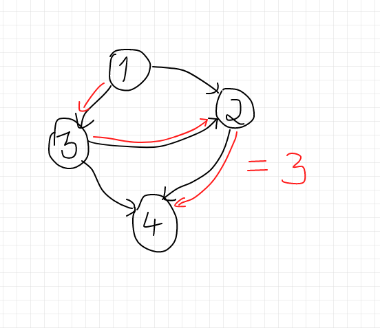
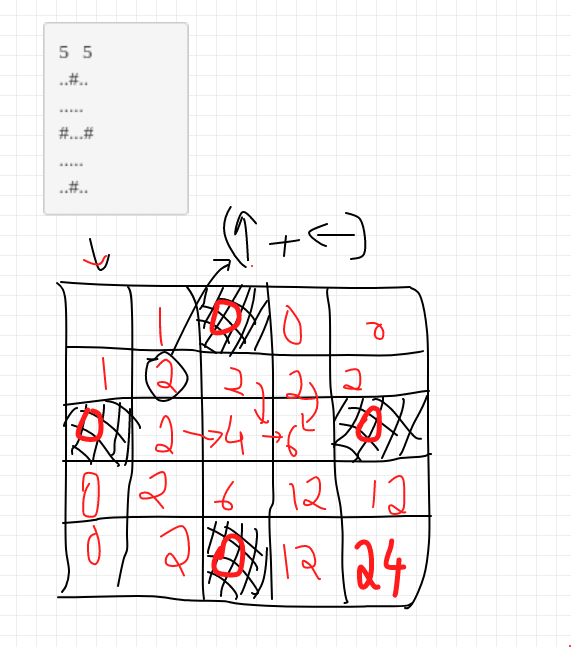

**PS: This is still WIP.**

I will be writing down the solutions (and my approach) of the dynamic programming problems I have solved from the [Atcoder Educational DP Contest](https://atcoder.jp/contests/dp). This post will be used a reference whenever I wish to revise Dynamic Programming.
This contest has 26 problems [A-Z] of varying difficulties. I will be writing the solution for first 12-13 problems and the rest will come in a later post.
I will be writing about the thought I had while identifying the state, what exactly does the DP state signify (meaning of DP <sub>i, j, ...</sub>) and the DP relation. 

 **A**  &nbsp;   [FROG 1](https://atcoder.jp/contests/dp/tasks/dp_a)


**PROBLEM LINK:** https://atcoder.jp/contests/dp/tasks/dp_a

**SOLUTION**

*Identifying the states* 

We can see that in reaching from one stone to another, only the stone number changes and we can get the height of any stone number (an array of heights is given), so there will be only one state that is : **stone number**
cost of `|h[i] - h[j]|` is incurred when we jump from i<sup>th</sup> stone to j<sup>th</sup> stone

*Meaning of DP state*

Here `DP[i]` means the minimum cost incurred for the frog to reach i<sup>th</sup> stone. So since a frog can reach i<sup>th</sup> stone only from (i-1)<sup>th</sup> stone and (i-2)<sup>th</sup> stone the dp relation will be as follow: 



DP[i] = min((DP[i-1] + abs(h[i] - h[i-1])), (DP[i-2] + abs(h[i] - h[i-2]))



The final answer will be `DP[n]` which means the minimum cost incurred to reach n<sup>th</sup> stone. 
We can also see that since the answer for  `i` is only dependent on `(i-1)` and `(i-2)` stone we can do it in constant space.

<hr/>

**B**  &nbsp;   [FROG 2](https://atcoder.jp/contests/dp/tasks/dp_b)


**PROBLEM LINK:** https://atcoder.jp/contests/dp/tasks/dp_b

**SOLUTION**

*Identifying the states* 

This problem is similar to previous one however now the frog can jump from any stonein the range `[i-1, i-2, i-3,...., i-K]` with the same `|h[i]-h[j]|` cost incurred. Again the state will be the **stone number** since only the stone number matters. 

*Meaning of DP state*

Here `DP[i]` means the minimum cost incurred for the frog to reach `i` stone. So since a frog can reach `i` stone from any of these stones : `[i-1, i-2, i-3,...., i-K]`.



for(int j = max(1, i-K); j < i; j++){
    DP[i] = min(DP[i], (DP[j] + abs(h[i] - h[j]));
}



The final answer will be `DP[n]` which means the minimum cost incurred to reach `n` stone. The time complexity will be `O(n^2)` and the space complexity will be `O(n)`.

<hr/>


**C**  &nbsp;   [VACATION](https://atcoder.jp/contests/dp/tasks/dp_c)


**PROBLEM LINK:** https://atcoder.jp/contests/dp/tasks/dp_c

**SOLUTION**

*Identifying the states* 

Seeing the problem it is clear that the vacation consists of `N` days, and we need to find the maximum total points. Also, Taro has some activities out of which he does one on `i` day and does not repeat for two or more consecutive days so the dp states will be `days` and `activity performed` (since every activity has different points). Hence we create a DP array of `Days * activities`.

*Meaning of DP state*

`DP[i][j]` would mean the maximum number of points on `i` day given that Taro performs `j` activity. 
We also need to make sure that Taro does not repeat an activity so the solution will be something like below : 


for(int i = 0; i < days; i++){
    for(int j = 0; j < activities; j++){
        dp[i][j] = pointsofactivity_j_on_i_day + max(dp[i-1][all activities except j]);
        //we need to make sure that we do not include j as the previous activity. 
    }
}


The final answer will be max of `DP[N][j]` where N is total number of days and `j` are all the activities.
<hr/>

**D**  &nbsp;   [KNAPSACK 1](https://atcoder.jp/contests/dp/tasks/dp_d)


**PROBLEM LINK:** https://atcoder.jp/contests/dp/tasks/dp_d

**SOLUTION**

*Identifying the states* 

Well it is the classical Knapsack and we can see that Taro has to choose some N items and maximum capacity is W. He has to have the maximum value and he only has two choices, either to pick an item and put it in his bag or not to pick the item. So the DP states will be `N` and `W` since it only matters the number of items Taro picks up and the total weight in the knapsack.  

*Meaning of DP state*

Here `DP[i][j]` would mean the maximum **value*** we get after choosing (yes or no) the first `i` items and maximum weight as `j`. We get two options, either take an item or not to take the item.
Hence it will be the maximum of: 
1. Taking the item: `val[i] + DP[i-1][j-wt[i]]` (weight empty reduces)
2. Not taking item : `DP[i-1][j]` (weight empty is still the same)



for(int i = 0; i < N; i++){
    for(int j = 0; j < wt.size(); j++){
        DP[i][j] = max(DP[i-1][j], val[i] + DP[i-1][j-wt[i]]);

        // (need to make sure that wt[i] <= j)
    }
}




The final answer will be `DP[N][W]` which means the maximum value with all the N items seen and maximum weight as W.
<hr/>

**E**  &nbsp;   [KNAPSACK 2](https://atcoder.jp/contests/dp/tasks/dp_e)


**PROBLEM LINK:** https://atcoder.jp/contests/dp/tasks/dp_e

**SOLUTION**

*Identifying the states* 
This problem is just the same as the previous problem with a few changes. The limits have been changed. 
Now, 
```
1 ≤ N ≤ 100
1 ≤ W ≤ 10^9
1 ≤ w[i] ≤ W 
1 ≤ v[i] ≤ 10^3
```

We can see that the value of W we used in the previous problem is `1e9` which is too large for us to make it as a DP state, hence we will change the DP state from W to `V` where `V` means the maximum value (which can be just 1e3). 

*Meaning of DP state*

Since we changed the state the meaning of DP state changes as well. 
Now, `DP[i][j]` is the minimum weight we can use to make maxValue as `j` and by using `i` items (again choosing or not choosing is a choice).

Just like the previous problem, we will either take the item or not take it.

1. Taking the item: `wt[i] + DP[i-1][j-val[i]]`
2. Not taking item : `DP[i-1][j]` 




for(int i = 1; i <= n; i++){
  	for(int j = 0; j<=V; j++){
  		dp[i][j] = min(dp[i][j], dp[i-1][j]);
  		if(j >= val[i-1]) dp[i][j] = min(dp[i][j], wt[i] + dp[i-1][j-val[i]]);

        // (need to make sure that val[i] <= j)
        // (it is minimum since we want the min weight)
  	}
  }


The final answer will be the maximum `j` in the `DP[N][j]` for which we got the `DP[N][j] < W`.
<hr/>


**F**  &nbsp;   [LCS](https://atcoder.jp/contests/dp/tasks/dp_f)


**PROBLEM LINK:** https://atcoder.jp/contests/dp/tasks/dp_f

**SOLUTION**

*Identifying the states* 

Finding the longest common subsequence is a very well known problem for dynamic programming. We are given two strings `s` and `t` and we need to find the longest string that is subsequence to both s and t.
Ofcourse, we will have an option to either include `s[i]` or not and similar case with `t[j]`
Hence the two states will be `i` and `j`.

*Meaning of DP state*

The `DP[i][j]` would indicate length of longest subsequence with first `i` characters of `s` and first `j` characters of `t`. We first construct the DP array which would signify length of longest subsequence and then we trace back to get the actual string.



for(int i = 0; i < s.length(); i++){
    for(int j = 0; j < s.length(); j++){
        if(s[i] == t[j]) DP[i][j] += 1;
        else DP[i][j] = max(DP[i-1][j], DP[i][j-1]);
    }
}

//tracing back the same we constructed the max array

string ans = "";
 while(i >= 1 && j >= 1){
  	if(s[i-1] == t[j-1]){
  		ans += s[i-1];
  		i--;
  		j--;
  	}else if(dp[i-1][j] > dp[i][j-1]) i--;
  	else j--;
  }

<hr/>


**G**  &nbsp;   [LONGEST PATH](https://atcoder.jp/contests/dp/tasks/dp_g)


**PROBLEM LINK:** https://atcoder.jp/contests/dp/tasks/dp_g

**SOLUTION**

*Identifying the states* 

So we are given a DAG (directed acyclic graph) and we need to find the length of longest directed path in G. Let us understand the problem more with an example. 



We can see that the length of longest directed path is 3 in the above example.

In a DAG the first thing that comes to the mind is DFS, and this problem can easily be solved with DFS. 
Here the only state is *node number* since we only need to calculate that.

*Meaning of DP state*

`DP[a]` would mean the length of longest directed path which starts at node `a`. We will just use normal DFS but keep on updating the DP array accordingly.
The dfs function will look like this : 


void dfs(int a){
    visited[a] = true;
    for(node in allNeighbours){
        if(!visited(node)) dfs(node);
        //since we can reach that node through a; 
        dp[a]= max(dp[a], dp[node] + 1);
    }
}

//we take the maxi
for(value in dp){
    answer = max(value, answer);
}


<hr/>


**H**  &nbsp;   [GRID 1](https://atcoder.jp/contests/dp/tasks/dp_h)


**PROBLEM LINK:** https://atcoder.jp/contests/dp/tasks/dp_h

**SOLUTION**

*Identifying the states* 

In this problem we need to calculate number of paths in going from `(1, 1)` to `(H, W)` and we can only go if the the square is empty (has a `.`) and we cannot pass if there is a wall (`#`). Also Taro can go only **Down or Right**. 

The states will be clearly `i` and `j` which denote the length and width of a column.

*Meaning of DP state*

Here `DP[i][j]` would denote the number of paths from `(1, 1)` to `(i, j)`.

We can see in the below image how we are making our dp array. to reach every (i, j) the number of options are (i, j-1) + (i-1, j).







//dp[1][i] and dp[i][1] will be 1 as long as dp[1][i-1] and dp[i-1][1] are . (empty spaces). 
for(int i = 2; i <= h; i++){
    for(int j = 2; j<= w; j++){
        if(i, j is blank space) dp[i][j] = (dp[i-1][j] + dp[i][j-1]);
        else dp[i][j] = 0;
    }
}



The final answer will be ofcourse `DP[n][m]` which means the number of ways to reach `n` row and `m` column. 

<hr/>


PS: I am still writing this post and it is work in progress 🚧 


<!-- 
**I**  &nbsp;   [COINS](https://atcoder.jp/contests/dp/tasks/dp_i)


**PROBLEM LINK:** https://atcoder.jp/contests/dp/tasks/dp_i

**SOLUTION**

**Incomplete So Far**

*Identifying the states* 

We are given N coins, which are tossed. The coins are biased tho. The probability of getting heads when coin `i` is tossed is `p[i]` which would mean of getting tails is `1 - p[i]`. Also N is odd so both heads and tails cant come equal number of times. We need to find the probability of having more heads than tails. 
Let us see what really matters in the problem: Since we need to find the proability of getting more heads than tails, the number of heads matter and the probability of getting heads or tails matter, and total number of coin tosses matter but since we can get the `P[head] or P[tails]` we only need two states : number of heads & number of coin tosses. 


*Meaning of DP state*

`DP[i][j]` would mean the probability of getting `j` heads in `i` coin tosses.
We can understand more by trying to make the DP table. -->


<!-- 


<hr/> -->