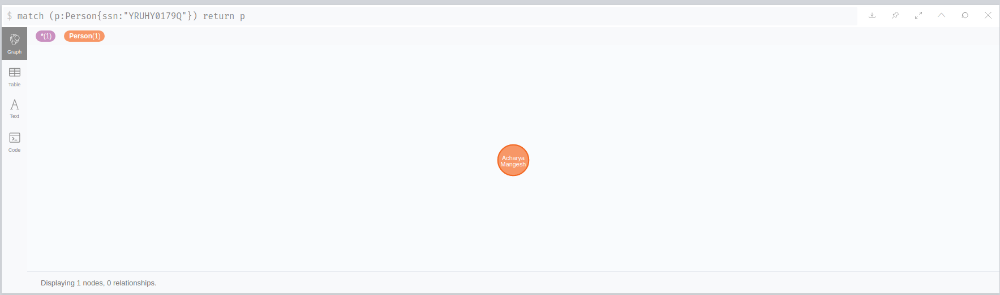
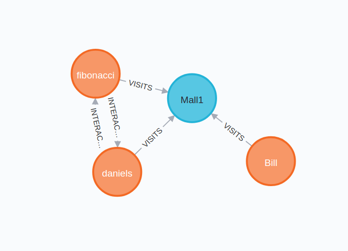
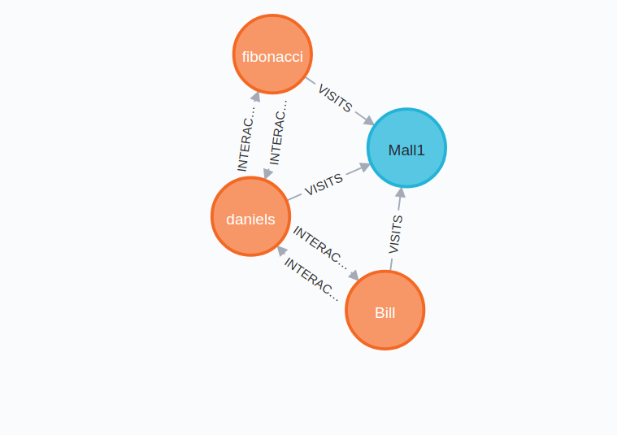
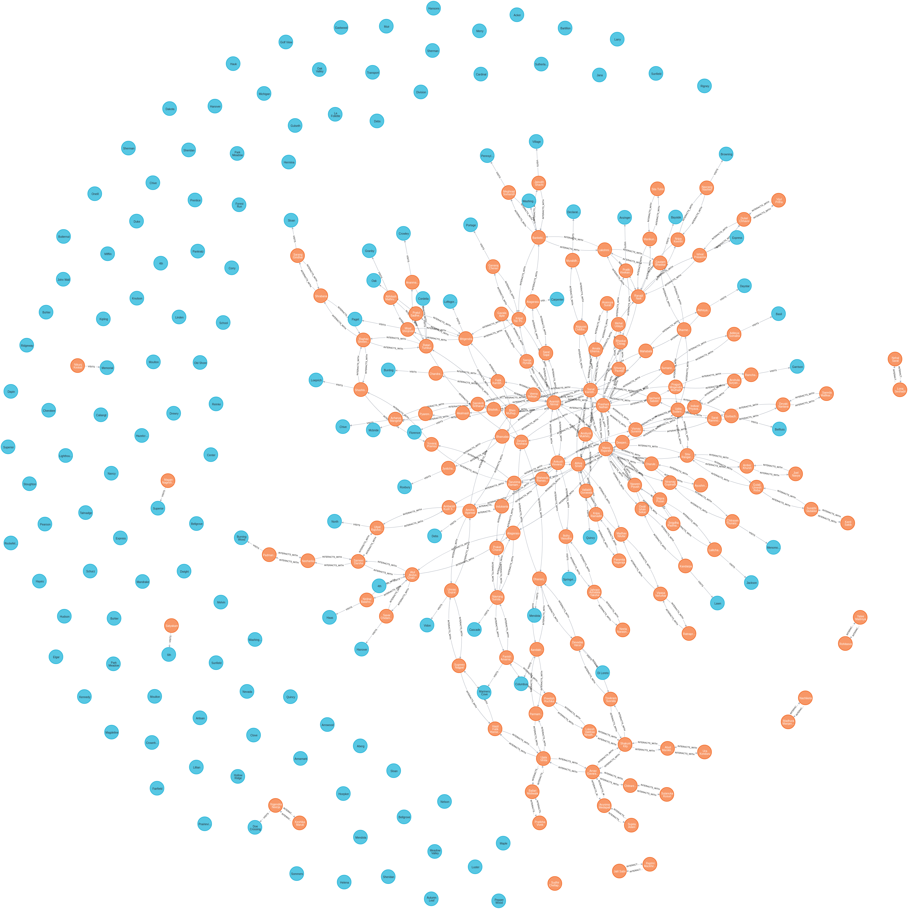
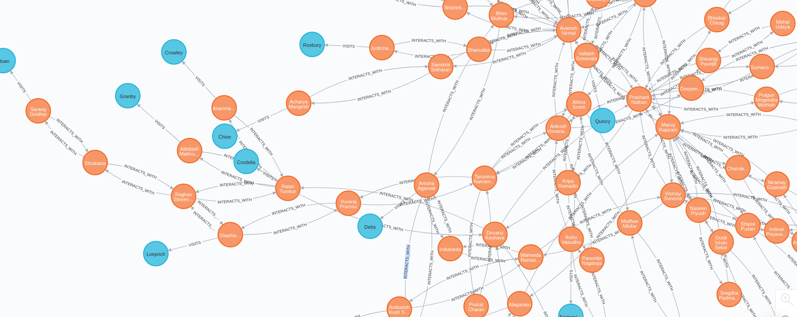
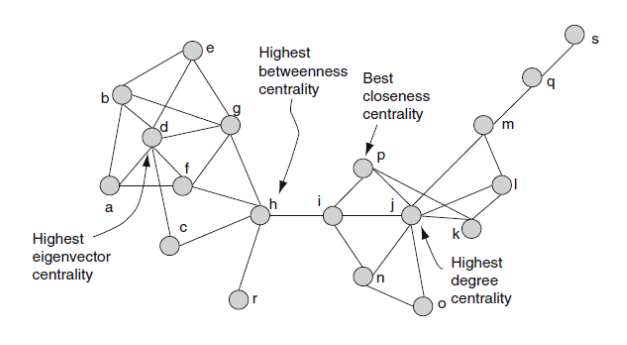

### Problem Statement

In India, when the country got exposed to COVID-19, we had very limited testing kits and with such a huge population, whom to test and whom not to became a serious challenge. The testing strategy followed at that time, was based on a person’s travel history, if they were showing symptoms or not and so on. The fact that a healthy asymptomatic human being can be a **carrier for the virus** was ignored, and we were unable to control the Community Spread which led to a huge surge in the number of cases. The question arises on **whom to test and whom not to when the country has limited testing available.**

### Proposed Solution

There are no such apps which talk about effective testing, however there are a few applications which were used by the Government for Contact Tracing, like Aarogya Setu. The way aarogya setu worked was that it used the bluetooth technology in order to find the covid infected people near one person. When two people with their smartphones interact, a secure digital signature is exchanged through which it is determined if a person has contacted someone with COVID or not.
Our application defines a testing strategy for the government based on the concept of Betweenness Centrality. The shortcomings of the bluetooth based solution were that it ignored the fact that a human being with no symptoms can also be a carrier of the Virus, which we have considered. *We made a complete web application, but in this post I will only be talking about how we structured the database, and how we achieved the task. I will also be listing down the queries.*

We have used Graph Databases for this task, where every person and location will be a node and all the nodes will be connected (according to their interactions). We will also be making connections between two people if they visited a place on the same day. To contain spread, we will be using the concept of articulation points and Centrality Measures. I will be talking in detail about which centrality measure will we use and why. 

Graph databases effectively store data relationships; they’re also flexible when expanding a data model and graph really shines in around relationship analysis, where the connections are between people. For our use case, we have used the [neo4j](https://sandbox.neo4j.com/) database. 

The initial part was to load the data into the graph databases, and initialize the nodes and define the relationships between different nodes.

The first type of node was the Person node, which would define the information about a person. We made separate CSV files, and then loaded the data as follow : 

The information about the Person that we stored was -

- SSN
- NAME
- ADDRESS
- SHOWING SYMPTOMS *(boolean)*
- COVID INFECTED *(boolean)*

```sql
load csv with headers from 
"https://docs.google.com/spreadsheets/d/e/2PACX-1vTdx9D4Xzrbitz5gDbd-MH7iALAZjYdOpq7Bx6pVAeVEH6_NZC_CQSWC51Tl6ODHkU0WTgSfJshzPUZ/pub?gid=0&single=true&output=csv"
as per
create (p:Person{ssn:per.SSN, name:per.Name,address:per.Address,symptoms:per.ShowingSymptoms, infected:per.CovidInfected})
```
Below is a sample node.
*We had 150 similar nodes in the database (as per the csv file we used to load)*



Now, to create relationships between people:

The below csv file just contained information about who meets who, and we create an `INTERACTS_WITH` Relationship amongst these people.

```sql
load csv with headers from 
"https://docs.google.com/spreadsheets/d/e/2PACX-1vTdx9D4Xzrbitz5gDbd-MH7iALAZjYdOpq7Bx6pVAeVEH6_NZC_CQSWC51Tl6ODHkU0WTgSfJshzPUZ/pub?gid=1511060139&single=true&output=csv" as meeting
match(p:Person{ssn:meeting.Person1}), (p2:Person{ssn:meeting.Person2})
create (p)-[:INTERACTS_WITH]->(p2)
create (p2)-[:INTERACTS_WITH]->(p)
```

We are assigning a cost to every `INTERACTS_WITH` relationship, which in the future we might use, as we can increase the cost of relationships with already infected people : 

```sql
match (p1:Person)-[i:INTERACTS_WITH]->(p2:Person) set i.cost = 1
```

Adding some locations to the database : 

```sql
load csv with headers from 
"https://docs.google.com/spreadsheets/d/e/2PACX-1vTdx9D4Xzrbitz5gDbd-MH7iALAZjYdOpq7Bx6pVAeVEH6_NZC_CQSWC51Tl6ODHkU0WTgSfJshzPUZ/pub?gid=2096582175&single=true&output=csv"
as locations
create (l:Location{longlat:locations.longlat, name: locations.Name, city:locations.City, state:locations.State})
```


and making a few people go to some location on some date : 

```sql
load csv with headers from 
"https://docs.google.com/spreadsheets/d/e/2PACX-1vTdx9D4Xzrbitz5gDbd-MH7iALAZjYdOpq7Bx6pVAeVEH6_NZC_CQSWC51Tl6ODHkU0WTgSfJshzPUZ/pub?gid=1139166921&single=true&output=csv" as visi
match(p:Person), (l:Location)
where p.ssn = visi.PersonSSN and l.longlat = visi.PlaceVisitedID
create (p)-[vi:VISITS{date:visi.VisitedOn}]->(l)
```

We have created the basic relationships and the nodes. One of the feature that we added was to auto create relatonships between two people in case two people visit the same location on the same date. 
This will be more clear in the below example : 

In the below figure, fibonacci visits `Mall1` on 30th July and Daniels visits `Mall1` on 31st July.

Say, Bill visits `Mall1` on 31st July as well, then an `INTERACTS_WITH` relationship should be created between daniels and Bill.



We do so, because there are high chances that Daniels might have interacted with Bill.

```sql
match (p1:Person)-[v1:VISITS]->(l1:Location)<-[v2:VISITS]-(p2:Person)
where v1.date = v2.date and id(p1) < id(p2)
create (p1)-[:INTERACTS_WITH]->(p2)
create (p2)-[:INTERACTS_WITH]->(p1)
```

Now, if we visualize this graph, we can see a new `INTERACTS_WITH` relationship has been created between Daniels and Bill : 



After this, our graph db looks something like this : 




The orange nodes signify the people, and the blue nodes signify the locations. In this dataset, a lot of locations were unvisited. 



Now that the graph is created, with all relationships defined, we come to our solution of Centrality in order to find which People to test first and quarantine.

We have used the concept of Articulation points and Centrality.

> Why Articulation points and Centrality?

In a graph, a vertex is called an articulation point if removing it and all the edges associated with it results in the increase of the number of connected components
Every vertex is a Human Being in our network. We wish to find those articulation points which are the most influential. (most connectivity) Here comes the concept of Betweenness Centrality.
In graph theory and network analysis, indicators of centrality identify the most important vertices within a graph. We can easily find the super spreaders of disease using this.

### Betweenness Centrality



The basic definition is : In graph theory, betweenness centrality is a measure of centrality in a graph based on shortest paths. For every pair of vertices in a connected graph, there exists at least one shortest path between the vertices such that either the number of edges that the path passes through (for unweighted graphs) or the sum of the weights of the edges (for weighted graphs) is minimized. The betweenness centrality for each vertex is the number of these shortest paths that pass through the vertex.

But in simple terms, it represents the degree to which nodes stand between each other. For example, in a telecommunications network, a node with higher betweenness centrality would have more control over the network, because more information will pass through that node. It tells which node in the graph controls the flow of information in the graph.

What we are doing here is, we are taking the betweenness centrality and returning the top 10 nodes (Person Nodes) whom should be tested first.

```sql
CALL gds.alpha.betweenness.stream({
	nodeProjection: 'Person',
	  relationshipProjection: {
	    INTERACTS_WITH: {
	      type: 'INTERACTS_WITH',
	      properties: 'cost',
	      orientation: 'UNDIRECTED'
	    }
	  }
	})
YIELD nodeId, centrality
match(p: Person) where id(p) = nodeId and p.infected='FALSE' return p.ssn as ssn,p.name as name,p.address as address,centrality order by centrality desc LIMIT 10
```

The above query will return the information for the first 10 people, whom we should test first.

Using shortest path, we have also calculated which person to stay away from : 

```sql
MATCH(start:Person{ssn:"KOAHM4127V"}), (end:Person{infected:"TRUE"})
CALL gds.alpha.shortestPath.stream({
  nodeProjection: 'Person',
  relationshipProjection: {
    INTERACTS_WITH: {
      type: 'INTERACTS_WITH',
      properties: 'cost',
      orientation: 'UNDIRECTED'
    }
  },
  startNode: start,
  endNode: end,
  relationshipWeightProperty: 'cost'
})
YIELD nodeId, cost
MATCH(other: Person) WHERE id(other) = nodeId and other.infected = 'TRUE' RETURN distinct other.name AS name, other.address as address,cost order by cost asc limit 5
```

And, we can get the hostpots of a city : 

```sql
MATCH(l:Location), (p:Person{infected:"TRUE"})
RETURN l.name AS name, SIZE((p)-[:VISITS]->(l)) AS size order by size desc limit 10
```

### Conclusion

We were able to manipulate the network of people and the locations in order to find the :
1. Most vulnerable people (whom to test) (sorted in order of Betweenness Centrality) -
Effective Testing Strategy can be achieved using our application as it will result us with the list of Individuals along with their address which are the prime suspect and potential carriers for Communal Spread.
2. Most vulnerable locations (as a heatmap) - Corona Heatmap showing all the Most Infected Locations based on our Graph Data plotted on google maps which should be Sealed immediately, and our application users can ignore these Hotspot.
3. Whom to stay away from (calculated on basis of Dijkstras Shortest Path) (sorted in that order) - Provide List of Infected Patients nearby based on the location of logged in user.