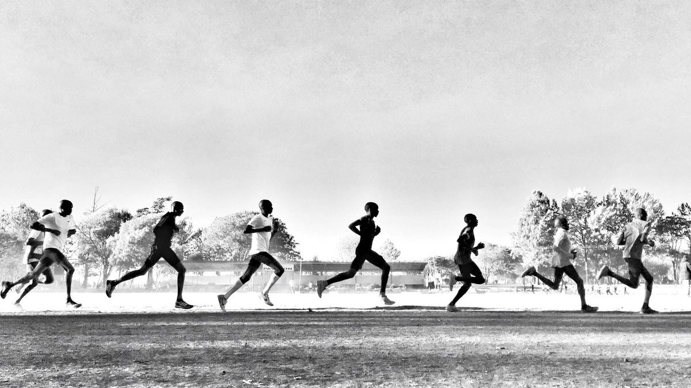

I have always been a big fan of Eliud Kipchoge. He is the goat 🐐 when it comes to long distance running. I followed his journey of running a marathon under 2 hours, by Nike, and just the guts of him attempting something like that is crazy. Pushing human limits to an extent which is hard to imagine, is just commendable. In his intro video, the orator described him as a chess grandmaster, so calm and so composed, you can never tell what is going on in his head. He is a top notch world class athlete, a multi millionaire, one of the most accomplished long distance runner. However, a look in his camp shows how humble he is.

> "I believe in a calm, simple, low profile life"

This is what Eliud has to say

> "You live simple, you train hard, you live an honest life then you are free" 

This man, Eliud talks about discipline.
According to Eliud, there are few factors to be successful.
One is Self-Discipline
Second is very well prepraration
Third is you should be well organised
Fourth is you should think positive
Fifth is actually working with people

Starting with self-discipline,self-discipline starts with you. start to examine yourself.
So self-discipline means is doing what's right rather than doing what you feel like doing.

It can save your feelings, get you on par on the course when you try to think otherwise.

Then when you are self-disciplined you can easily come back and think positively it tells you to actually do the right thing in the moment for long-term benefits.

How can you cultivate this self discipline?

One is that you should stick to your priorities.

Second is that don't make excuses. when you have decided to do something, do it.

Thirdly, learn to say no. 

Fourth, is that you make discipline your lifestyle.

Discipline is like building the muscle
It's like going to the gym, you cannot go to the gym today and build your muscle.
You should get a program and go slowly by slowly that's the way to build your muscle. 

That's the way you can cultivate your self discipline.

> Only the disciplined ones are free in life, if you are indisciplined you are a slave to your moods you are a slave to your passions

The best time to plan a tree was 25 years ago, that was the best time to plant the tree. today is the best time for you to plan a tree of self-discipline

Eliud is a leader to be honest. I feel I have a lot to learn, and just being disciplined can help me greatly in life. Hoping to revisit this post soon.

Eliud did run a sub 2 marathon btw, he ran 26.2 miles in 1 hour, 59 minutes, and 40 seconds. commendable. 👏🏼💨