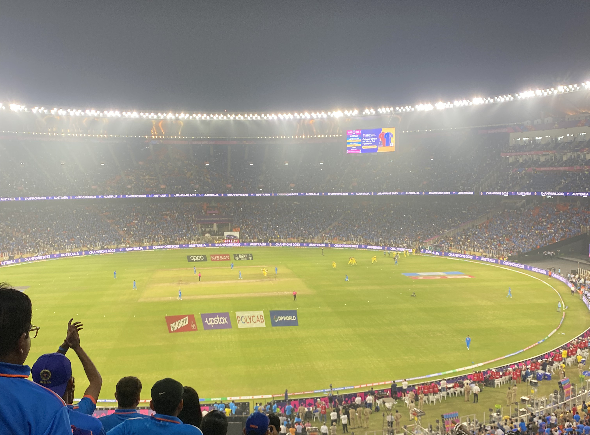
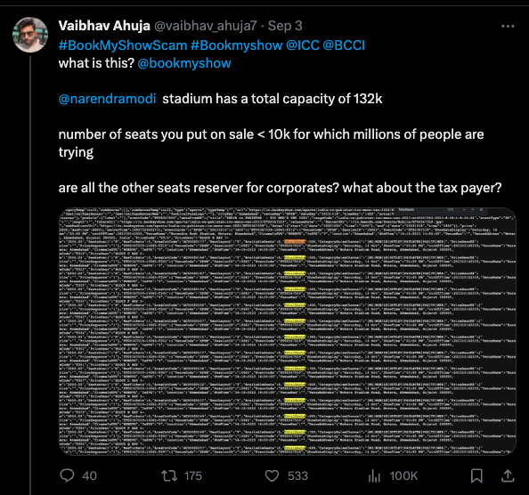
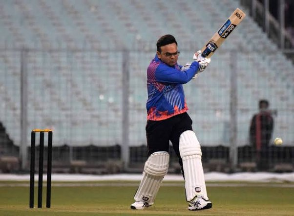

### Context

India is a cricket crazy country. No sport is celebrated as cricket is here. With this star studded team under the guidance of Jay Shah, we were all set to win the WC'23 but then australia happened. 



With India hosting the world cup, the demand for the tickets (for India matches) was unbelieveable, the whole country wanted to support the team in the stadium, and why not? BCCI decided to give [BookMyShow](https://in.bookmyshow.com/) the rights to be the sole ticket distributor, and I am glad they did. Any ticket purchased for the world cup, was to be purchased on the online platform of BookMyShow. The thing is, that the seats are limited and there is no limit to the number of people who want their hands on the tickets.

A quick overview of how the sale for india matches happened.

#### Sample Timeline of the ticket booking process

1. **[A day before sale day]**
BCCI announces on Twitter/News about the sale for the ticket. (say e.g "India vs Pakistan tickets to be out on 8pm on dd/mm/yyyy on BookMyShow")
1. **[7:58PM]**
All the cricket fans, are ready with their laptops , bombarding the bookMyShow systems to book the tickets.
1. **[8.00PM]** 
BookMyShow adds the fans to a queue to book the tickets
1. **[8.55PM]** 
99% fans leave the queue with a message "The tickets are SOLD OUT!"
If lucky, and you get in the queue, you are free to book the tickets.

#### Issues

- No transparency with the system. No one has idea about how many tickets are being released on DAY x.
- With almost everyone trying to get in the system at 8.00PM, who is able to pass the queue and who is not, depends highly on the luck of the individual.
- My luck isn't that great, so when I tried to get in the queue for Ind VS Pak for the first time, all the tickets were sold out, and I could not get the tickets.

Although I was unable to get the tickets, I somehow managed to get my hands on the API which has seat information, and I was shocked to see how little tickets BMS is releasing. Now agreed, BMS is just a platform and the ticket seller can control, but transparency is something a buyer would expect. They just released 8-9k seats in a stadium with total capacity of 132k.
There was very little chances that I could get the tickets this way, so I tried to think in other directions.

<blockquote class="twitter-tweet"><p lang="en" dir="ltr"><a href="https://twitter.com/hashtag/BookMyShowScam?src=hash&amp;ref_src=twsrc%5Etfw">#BookMyShowScam</a> <a href="https://twitter.com/hashtag/Bookmyshow?src=hash&amp;ref_src=twsrc%5Etfw">#Bookmyshow</a> <a href="https://twitter.com/ICC?ref_src=twsrc%5Etfw">@ICC</a> <a href="https://twitter.com/BCCI?ref_src=twsrc%5Etfw">@BCCI</a> <br>what is this? <a href="https://twitter.com/bookmyshow?ref_src=twsrc%5Etfw">@bookmyshow</a> <a href="https://twitter.com/narendramodi?ref_src=twsrc%5Etfw">@narendramodi</a> stadium has a total capacity of 132k <br><br>number of seats you put on sale &lt; 10k for which millions of people are trying<br><br>are all the other seats reserver for corporates? what about the tax payer? <a href="https://t.co/6KYanGrDQx">pic.twitter.com/6KYanGrDQx</a></p>&mdash; Vaibhav Ahuja (@vaibhav_ahuja7) <a href="https://twitter.com/vaibhav_ahuja7/status/1698348472377000291?ref_src=twsrc%5Etfw">September 3, 2023</a></blockquote> <script async src="https://platform.twitter.com/widgets.js" charset="utf-8"></script>

<!--  -->

### My Thought process

- BookMyShow has a queue based system, and they add people in the queue on the basis of time they enter the queue.
- At exactly 8, system is bombarded with requests. System must be experiencing atleast 15-20M RPM, and pre scaling must be done. What is pre scaling? *Before experiencing high loads, systems are already scaled, so it does not take time for scaling when the demand increases and requests are not throttled.* Also the API must be public before 8. They cannot keep the API private until 8.
- The queue system must have an API exposed, something like this, which is already scaled :


addToQueue(userId int64, currentTime time.Time, details MatchDetails) {
    //adds the user to queue at time [currentTime] for match [details]
}

- Since the system is exposed 5-10 minutes before the time, all we needed to do, was figure out a way how to hit the API before 8pm, to get an edge over the other people trying to get inside the queue at 8.00PM.

#### Figuring out the Queue URL

- After a few unsuccessful attempts in booking the tickets, I figured out that every queue URL (from where you enter the queue) has a well defined pattern.
##### Pattern for the URL


While going through the URLs for the past matches, I saw the URL looked like this.
```{baseUrl}/sports/<match_name>/seat-layout/aerialcanvas/<matchId>/<stadiumCode>/<matchCode>```

- Basically, for entering in a queue, we just needed the above parameters.
- It was easy to figure out the other parameters, but `matchCode` was a random 6 digit numeric code.
- I saw a few matches and realised that the `matchCode` is between 10000 and 10200, so a simple brute force would help in cracking the URL. I quickly wrote a shell script to brute force the urls and return the one which we need. Here is the script : 

<script src="https://gist.github.com/vaibhavahuja/1fd19d1ff8fefbacb48c6d4b3fc9fcfe.js"></script>

That is it, with this script I managed to get the urls for every match before hand, and used it to get in the queue at 7:55PM. This gave me an edge of around 5 minutes, over anyone else. Since the majority logged in at 8, I was put in queue ahead of them, and was able to book the tickets without any hassle. 

### Fetching the Real Time Seat Information

I was able to scrape the API for fetching the tickets, and I saw a lot of tweets regarding the same, cursing BMS for releasing a small number of tickets. Seems, bookMyShow decided to encrypt the response now. But, it was easy to decrypt, because maybe the bms devs did not realise that the client would in the end have to decrypt the response. It really did not make any sense to send an encrypted response to the client.


Sample cURL for fetching seat info

```curl 'https://in.bookmyshow.com/api/le/seatLayout/showinfo?venueCode=KSCA&sessionID=10057&eventCode=ET00367591' \
  -H 'user-agent: Mozilla/5.0 (Linux; Android 6.0; Nexus 5 Build/MRA58N) AppleWebKit/537.36 (KHTML, like Gecko) Chrome/119.0.0.0 Mobile Safari/537.36' \
  -H 'x-bms-le-app-code: WEB' \
  --compressed```


Response -> [JSON BLOB RESPONSE](https://jsonblob.com/1179043777594908672)

Since this data was encrypted, I started fiddling with the client code to figure out how they decrypted it and came across this method.
[Here](https://gist.github.com/vaibhavahuja/02648eb7fb30d33478929971591d21e9) is the full file if anyone is interested. 


function a(e) {
            var t = o.a.enc.Base64.parse(e)
              , n = o.a.enc.Utf8.parse("yW8YubOEm5DhPlvy0MDOM0RljolbjisR")
              , r = o.a.enc.Utf8.parse("yW8YubOEm5DhPlvy");
            return o.a.AES.decrypt({
                ciphertext: t
            }, n, {
                mode: o.a.mode.CBC,
                iv: r
            }).toString(o.a.enc.Utf8)
        }



They had encrypted the response using `AES`, with Cipher Mode as `CBC` and the key size as `256 bits`. It really does not make sense to decrypt at client!!

Decrypted the response with some [online decryption tool](https://www.devglan.com/online-tools/aes-encryption-decryption) and got a base64 encoded response, which on decoding, you get the actual response.

Response attached [here](http://jsonblob.com/1179045408126394368).

### Conclusion

- BMS should have enhanced the security tbh. By generating a new url per user (using some hmac or something) things would have been extremely hard for anyone to get inside the queue before the designated time. Or even better, BCCI could have started some lucky draw process to get the tickets. 
- BCCI should have been more transparent. CWC tickets should be released with a defined process, and transparency on how many tickets are being released and when, would have been amazing.
- E-Tickets would have been amazing. The way ticketing was organised in fifa'22 was something else.
- India shouldn't have taken Surya Kumar Yadav with them. He did not perform in a single match, and when the team needed him the most (in the finals), he gave strike to the tailenders and preferred to stand on the runners end. Just terrible.


