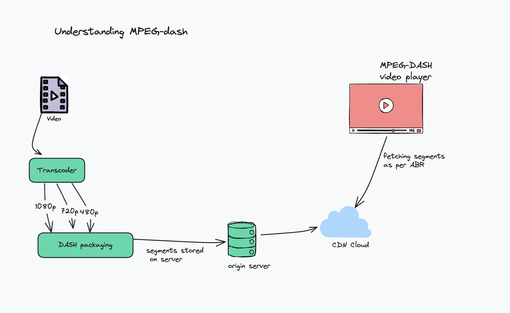

### What is DASH?

DASH is a video streaming format, which allows delivering high-quality video content. It stands for Dynamic Adaptive Streaming over HTTP, and allows adjusting the video quality based on bandwidth of the user.

For example, when you are streaming a video (VOD/LIVE) and your internet connection is flaky, you must have observed the player auto adjusts the quality to a lower resolution (1080p -> 480p), and restores it back to 1080p if internet is stable and high bandwidth. That is because of dash in action.
DASH describes the mechanics of ABR - Adaptive Bitrate Streaming, ensuring smooth delivery of a stream over internet.

#### How does a player do that?

Video is transcoded into multiple resolutions and bitrate combinations, known as "rendition".
Renditions are broken down into multiple segments which are further downloaded by the player.

Lets understand with an example. 

There is a video with total duration of 100 seconds. It is first transcoded into different bitrate variations (1080p, 720p, 480p, 360p) and every variation is broken into multiple segments, say 2 seconds each. 
Now, we have a total of 4 x 2 x 50 segments in total. These DASH files are packaged, and the chunks are stored on some server. 

There is usually a CDN which reads data from the server, and stores it in its cache, and serves the content to the client.

The player downloads the segments in real time as you stream, according to the principles of ABR (Adaptive Bitrate Streaming).

It gets the information of segment from the `.mpd` file.

### Structure of .mpd file

How does a client/player know the path of the segment? That information is stored in an `.mpd` file. The `.mpd` file is an XML file containing information about the paths of all segments, so the player knows exactly from where to download a particular segment in order to stream according to the representation ID.

Sample `.mpd` file : 



<?xml version="1.0" encoding="utf-8"?>
<!-- MPD file Generated with GPAC version 0.5.1-DEV-rev4736M  on 2013-09-11T09:51:52Z-->
<MPD xmlns="urn:mpeg:dash:schema:mpd:2011" minBufferTime="PT1.500000S" type="static" mediaPresentationDuration="PT0H10M54.00S" profiles="urn:mpeg:dash:profile:isoff-live:2011,http://dashif.org/guidelines/dash264">
    <Period id="" duration="PT0H10M54.00S">
        <AdaptationSet segmentAlignment="true" maxWidth="1280" maxHeight="720" maxFrameRate="24" par="16:9">
            <Representation id="1" mimeType="video/mp4" codecs="avc1.42c01f" width="512" height="288" frameRate="24" sar="1:1" startWithSAP="1" bandwidth="1082580">
                <SegmentTemplate timescale="12288" media="ED_512_640K_MPEG2_video_$Time$.mp4" initialization="ED_512_640K_MPEG2_video_init.mp4">
                    <SegmentTimeline>
                        <S d="24576" r="-1" />
                    </SegmentTimeline>
                </SegmentTemplate>
            </Representation>
            <Representation id="2" mimeType="video/mp4" codecs="avc1.42c01f" width="768" height="432" frameRate="24" sar="1:1" startWithSAP="1" bandwidth="1880897">
                <SegmentTemplate timescale="12288" media="ED_768_1440K_MPEG2_video_$Time$.mp4" initialization="ED_768_1440K_MPEG2_video_init.mp4">
                    <SegmentTimeline>
                        <S d="24576" r="-1" />
                    </SegmentTimeline>
                </SegmentTemplate>
            </Representation>
            <Representation id="3" mimeType="video/mp4" codecs="avc1.42c01f" width="1280" height="720" frameRate="24" sar="1:1" startWithSAP="1" bandwidth="4114301">
                <SegmentTemplate timescale="12288" media="ED_1280_4M_MPEG2_video_$Time$.mp4" initialization="ED_1280_4M_MPEG2_video_init.mp4">
                    <SegmentTimeline>
                        <S d="24576" r="-1" />
                    </SegmentTimeline>
                </SegmentTemplate>
            </Representation>
        </AdaptationSet>
        <AdaptationSet segmentAlignment="true">
            <Representation id="4" mimeType="audio/mp4" codecs="mp4a.40.29" audioSamplingRate="48000" startWithSAP="1" bandwidth="33432">
                <AudioChannelConfiguration schemeIdUri="urn:mpeg:dash:23003:3:audio_channel_configuration:2011" value="2" />
                <SegmentTemplate timescale="48000" media="ED_MPEG2_32k_$Time$.mp4" initialization="ED_MPEG2_32k_init.mp4">
                    <SegmentTimeline>
                        <S d="94208" r="-1" />
                    </SegmentTimeline>
                </SegmentTemplate>
            </Representation>
        </AdaptationSet>
    </Period>
</MPD>



Lets understand this with a quick diagram : 

- Every file is divided into multiple periods
- Every period has multiple AdaptationSets, which tell if that adaptation set contains content-type for `video` or `audio` or `image` or `text`
- Now, say you get inside adaptation set for Video, that wil have multiple RepresentationIds, which we discussed earlier, telling about the quality, and a segmentTemplate.
- A long video can have 1000's of segments, so in order to not make a file too big, segmentTemplate is a way to tell the player to generate the segments on the basis of other information provided.
- It contains the initialisationPath, and a segmentTimeline. The player would use this information to generate paths of the content.
- It further downloads the files, and plays it in a DASH player.

### Try checking how DASH works

Use this link : [https://dash.akamaized.net/dash264/TestCases/2c/qualcomm/1/MultiResMPEG2.mpd](https://dash.akamaized.net/dash264/TestCases/2c/qualcomm/1/MultiResMPEG2.mpd) and copy it in some online DASH player : [Akamai Dash Player](https://players.akamai.com/players/dashjs)

Click on playStream and head on to the Network tab to see the video segments being downloaded in real time.

Compare the path of every segment, with the mpd file shared above and things will become more clear.

### Conclusion

That is it for now. Hope you got some idea about how DASH works, another popular format for ABR is HLS. Will be writing about that soon. 

Hope you liked it.

