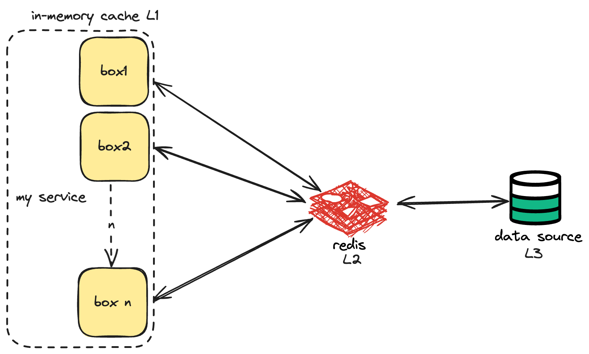

### Why?

We recently encountered a use case where we had to fetch data from a source, but as we scaled, we encountered performance issues. Also, the cost of reading from the datasource was extremely high after breaching a certain limit. 
Even if we could compromise on the cost of every request, performance was something highly critical. Naturally, we identified that the data is cacheable, and decided to get a redis layer between the service and datasource. We went ahead with a standalone redis, and fetched data from the redis instance on every call, but there was another problem. 

Redis used to reach its memory limits at high throughput, ad We needed another layer of caching, and decided to add an inmemory cache. All the nodes would cache this information in memory, and fetch from redis after a defined interval, which would eventually fetch from the primary data source. (**Chained Cache**). 

#### Why to have Redis in between and not just the primary source.
- To avoid extreme edge cases, where all the inmemory caches expire at t = t1, and all the requests are sent straight to the primary source, thus choking the database. Cost of every search is expensive. We want to avoid calls to the primary data source. 
- Won't the same thing happen with redis? If all the caches expire, and we get a million requests in one second, redis will go down again. 
    - We write a locking mechanism, at any time only one go routine will hit the redis and refresh in memory cache, while other go routines wait for some time / return stale data back to the client. 
    - This means at any point the maximum number of goroutines trying to refresh redis will be equal to the number of pods. 

### What? 

Chained Cache is a multi-layered caching strategy, each cache having different characteristics, to optimize data retrieval. The idea is to have a hierarchy of caches, where most frequently accessed data is stored in the fastest cache (in memory)

Had to structure this efficiently in my goLang service. My main requirements were:
- Add multiple layers of caching
- Invalidation of key on basis of time.
- Refresh L(n) cache from L(n+1) cache in case of invalidation, propagate the change in lower caches.
- Locking while refreshing so only one goroutine accesses the L(n+1) cache.
- Can enable/disable cache/s when I want
- Modify implementation of cache without affecting this chained cache module.

### Solutioning

Decided to write a quick backtracking solution for the same. In my example, any `struct` which implements this interface will be a cache. 


type Cache[K comparable, V any] interface {
    AddKey(K, V) error
    GetVal(K) (V, error)
}


### GoLang Implementation



func (chainSecond *ChainedCacheSecond[K, V]) Get(key K, index int) (V, error) {
    currCache := chainSecond.layers[index]
    val, err := currCache.GetVal(key)
    if err != nil {
        //did not find in currCache so will try to find in parent cache
        if index+1 < len(chainSecond.layers) {
            val, err = chainSecond.Get(key, index+1)
            if err == nil {
                //backtracking and updating the parent caches as well
                currCache.AddKey(key, val)
                //successfully found
                fmt.Println("found key in cache ", index+1)
                return val, nil
            } else {
                //found some error
                fmt.Println("key not found")
            }
        }
        //did not find the value after exploring all caches
        var v V
        return v, errors.New("did not find the key in any cache")
    }
    return val, err
}

### Conclusion 

Using this chained cache, I did achieve what I wanted to. Just a few things to keep in mind : 
- Be very sure of the base case while writing a recursive solution in production environment. This is very important.
- Depending on the application needs, one must make conscious decisions: 
    - If one cache fails, serve stale data or throw an error.
    - Cases in which one must do negative caching.
- Keeping an inmemory cache does provide great latencies, however, one must make sure of choosing the correct eviction policy as per their needs. Not choosing one will choke up the resources real quick. 
- Metrics are very important. How else will you know if your solution is working better than the existing one?

Hope you learned something!

