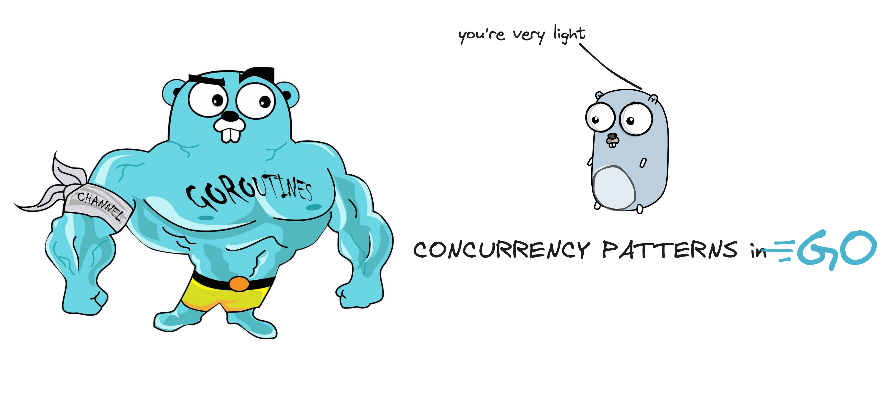
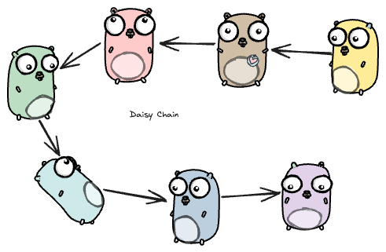

# What is concurrency? How is it different from parallelism?

Say you go to a very small pizza 🍕 shop. *How small?* There is only one person behind the counter who does all the work, named Mark. Mark is responsible for making sure you get the pizza, and handles all the accounting and billing, and taking the order, basically everything. 

You see Mark, and place your order. Mark takes the payment and goes to the kitchen to start preparing the order. He turns on the oven, prepares the pizza and puts it in the oven. More customers line up behind you, but Mark is inside waiting for the oven to prepare the pizza. Mark takes out the pizza from the oven, cuts it into 6 slices, and serves you fresh before taking any other orders, and the process goes on. 

During the time the pizza was in the oven, Mark could have taken more orders and started preparing the pizza base for other orders. Switching between different tasks as and when he can. This is like interleaving tasks without actually performing them simultaneously, i.e working concurrently. Here, concurrency would mean the ability of Mark to handle multiple tasks or operations simultaneously, by interleaving their execution. 

Parallelism would mean to get Mark's friend Tom to help him in the whole process. Get a separate oven, and Mark and Tom can do their work independently, truly performing tasks simultaneously. 

That is the difference between concurrency and parallelism.

# What are concurrency patterns? Why goLang?

GoLang is made for concurrency, having goRoutines and channels to communicate between them, truly makes it a top candidate to write concurrent tasks. In my experience, writing concurrent code was never this easier before goLang. *What are goRoutines and how do they work?* Will cover that in detail in some other blog, for now you can say, that goroutines are independently executing function, having its own call stack, grows and shrinks as required, and **it's not a thread** GoRoutines are multiplexed dynamically onto threads as needed. 

Concurrency patterns address common challenges such as task coordination, resource sharing, sync and communication between running processes or threads. If you plan on working with goLang and wish to add concurrency, chances are high that your problem can be solved with one of these patterns, easily. Similar to design patterns, but for **concurrency**.

# Patterns

## Generator : Function that returns a channel

Since channels are blocking, first and second although are concurrent, but will be printed one after another in order.


func main() {
    first := test("first")
    second := test("second")

    for i := 0; i < 5; i++ {
        fmt.Println(<-first)
        fmt.Println(<-second)
    }
    fmt.Println("i am done")
}

func test(msg string) <-chan string {
    c := make(chan string)
    go func() {
        for i := 0; ; i++ {
            c <- fmt.Sprintf("%s %d", msg, i)
            time.Sleep(time.Duration(rand.Intn(1e3)) * time.Millisecond)
        }
    }()
    return c
}


How to remove order, and return whichever is available first? We have multiplexing for that. 

### Multiplexing

### Fan-In
Takes two channels and returns one channel. 


func main() {
    c := fanIn(test("first"), test("second"))
    for i := 0; i < 10; i++ {
        fmt.Println(<-c)
    }
    fmt.Println("i am done")
}

func fanIn(input1, input2 <-chan string) <-chan string {
    c := make(chan string)
    go func() {
        for {
            c <- <-input1
        }
    }()
    go func() {
        for {
            c <- <-input2
        }
    }()
    return c
}


Channels become arguments of my `fanIn` method, and now when it runs, it is not necessarily synchronous.

### Select Statement

jash
Provides another way to handle multiple channels. It works like a switch, where each case is a communication. 
It blocks the program until one communication can proceed. If multiple channels have somed data in it, select chooses randomly. 

If there is a default clause, it executes immediately if no channel is ready.


    select {
    case v1 := <-c1:
        fmt.Println("received %v from c1", v1)
    case v2 := <-c2:
        fmt.Println("received %v from c2", v2)
    default:
        fmt.Println("no one ready to communicate")
    }


### Daisy Chain

The below code simulates the above picture, except the number of gophers is 10000. 

The function `f` takes two goroutines, right and left, and adds the value received on right and sends it to left. 



func f(left, right chan int) {
    left <- 1 + <-right
}

func main() {
    const n = 1e5
    leftmost := make(chan int)
    right := leftmost
    left := leftmost
    for i := 0; i < n; i++ {
        right = make(chan int)
        go f(left, right)
        left = right
    }
    go func(c chan int) { c <- 1 }(right)
    fmt.Println(<-leftmost)
}



### Timeout pattern

When we call external services in goroutines we don't want to be stuck/blocked waiting for them, we can use the timeout pattern in order to exit as soon as the time gets over. 

 
 c := make(chan Result)
    go func() { c <- Web(query) } ()
    go func() { c <- Image(query) } ()
    go func() { c <- Video(query) } ()

    timeout := time.After(80 * time.Millisecond)
    for i := 0; i < 3; i++ {
        select {
        case result := <-c:
            results = append(results, result)
        case <-timeout:
            fmt.Println("timed out")
            return
        }
    }
    return


### Conclusion

goRoutines make the program really fast, but we need to understand when and how to use it. I have seen people use them to make a synchronous task, synchronous. Just because it looks impressive doesn't mean it needs to be used every time. 

We also have `waitGroups` and `mutexes` which are used to solve problems, so having a knowledge of all is important. Always use the right tool for the job.

I will be writing more about how goroutines work internally and will be showing how to solve real life examples of using waitGroups and mutextes. Let me know what you think of this blog.

Have a good day!

