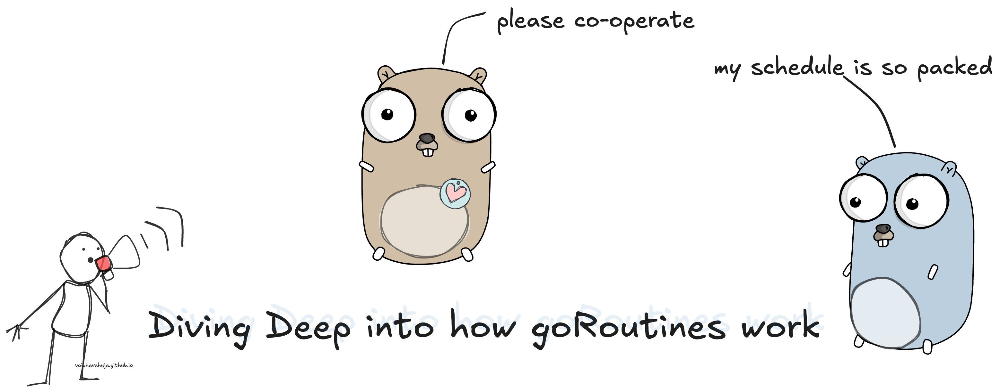
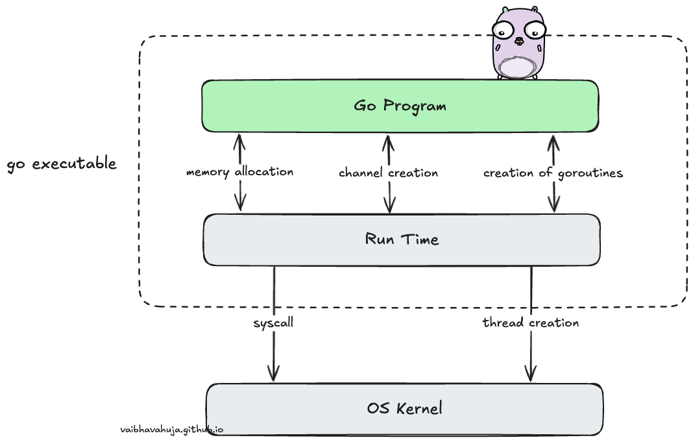
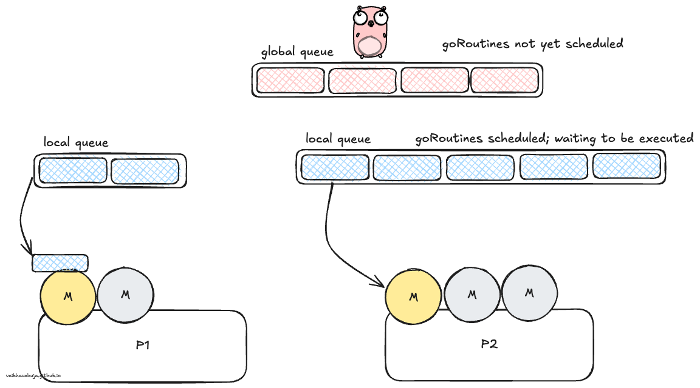

# What are goRoutines? How are they different from threads?

In my previous blog post, I talked about what concurrency is, and how is it different from parallelism. Here, I will be mainly talking about how GoRoutines work internally, and how are they so performant giving it an edge over all the other languages out there.

GoRoutines are lightweight abstractions over threads, managed by the GoRuntime itself. 
To Understand how are they different from threads, we see 3 factors - memory consumption, initialising and removing and switching time. 

### Memory 
Creation of goroutine requires around 2kb of space, whereas a thread start out at around 2MB (1000 x). The goroutines grow by allocating and freeing heap space as and when required. 

### Initialising and removing
In order to create a thread, a program needs to request for resources from the OS, and return back once the process is complete. However, since goroutines are managed by the run time, a pool of threads is maintained and goroutines are created and destroyed very cheaply. 

### Switching time
When a thread blocks, another has to be scheduled in its place. Threads follow preemptive scheduling, and during the thread switch the scheduler needs to save all registers. This is quite significant when there is rapid switching between the threads.

GoRoutines on the other hand are scheduled cooperatively (will talk more about this below), and only required 3 registers, hence the cost is much lower. Switching time is not affected by the number of goroutines.

# Scheduling in Go

In cooperative scheduling, goroutines yield the control periodically when they are idle of logically blocked in order to run multiple goRoutines. The switch between goRoutines happen only at well defined points - when call is made to the Goruntime scheduler. Those points are
- Channels send and receive operations
- Go Statement 
- Blocking sys calls
- After being stopped for Garbage Collection cycle.

### PMG
Go uses 3 entities to explain the GoRoutine Scheduling.

- Processor (P)
- OS Thread (M)
- GoRoutines (G)

Go has M:N scheduler that can also utilize multiple processors. At any time, M goroutines need to be scheduled on N OS threads that run on most `GOMAXPROCS` number of processors. 

The go runtime initiates a number of OS threads that is equal to the number of logical processors available to it.
`logical processors = number of physical cores * number of threads that can run on each core (hardware threads)`

There is a P-specific local and a global goroutine queue. Each M should be assigned to a P. Ps may have no Ms if they are blocked or in a system call. At any time, there are at most GOMAXPROCS number of P. At any time, only one M can run per P. More Ms can be created by the scheduler if required.

LRQ has the already scheduled goroutines, while GRQ contains the unscheduled ones. When the LRQ are getting emptied they get filled by fetching goroutines from Grq.

In each round of scheduling, the scheduler finds a runnable goroutine and executes it. Search happens in following order 


runtime.schedule() {
    // only 1/61 of the time, check the global runnable queue for a G.
    // if not found, check the local queue.
    // if not found,
    //     try to steal from other Ps.
    //     if not, check the global runnable queue.
    //     if not found, poll network.
}


Go scheduler does a lot to avoid excessive preemption of OS threads by scheduling them to the right and underutilized processors by stealing, as well as implementing “spinning” threads to avoid high occurrence of blocked/unblocked transitions.

# Conclusion

GoRoutines was named after a concept called `coroutines`. Very cheap performant wise, and this multiplexing goroutines and stealing ensures that highest efficiency is ensured. This makes GoLang an obvious choice while writing concurrent programs. Hope you learnt something and will consider GoLang while writing a highly *go*ncurrent program.

# Conclusion

